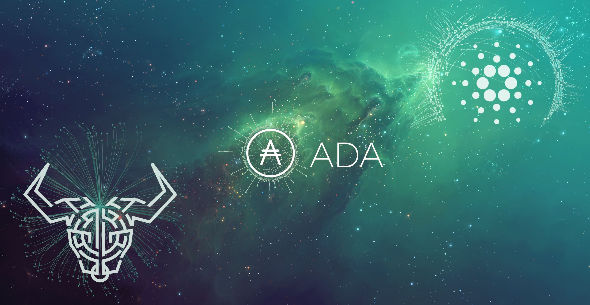

# Cardano-SCK

[](https://docs.openzeppelin.com/contracts/upgradeable)
[](https://www.npmjs.org/package/@openzeppelin/contracts-upgradeable)
[](https://github.com/MitchellTesla/Cardano-SCK/actions/workflows/codeql-analysis.yml)
[](https://github.com/MitchellTesla/Cardano-SCK/actions/workflows/njsscan-analysis.yml)
<p align="center">
  
</p> 

# Introduction
Research and Development (WIP) of Solidity smart-contracts for the Cardano KEVM and Blockchain.
This repository includes Rust-Cardano (Modular Toolbox), Cardano-Launcher, Hydra POC node, 2 jormungandr node implementations, and a Full-Node, Which is the core component used to participate in the Cardano decentralized blockchain. 

Just like Bitcoin, Cardano uses the UTXO (unspent transaction output) model where the inputs are unspent outputs from previous transactions. However, the network has expanded upon this to employ an extended UTXO model (EUTXO) which offers unique advantages over other accounting models.

Without going too deep into the technicalities of it, the EUTXO model essentially allows the validity of transactions to be checked off-chain before the transaction is sent to the blockchain. This is in contrast to Ethereum Layer 1 which processes transactions all on-chain. Transaction execution costs can be also determined off-chain before transmission which is another unique feature.

Plutus Core will be used to define the parameters of these EUTXO transactions and compile the code developed for smart contracts. A Plutus Application Framework (PAF) will provide easy access to services and applications running on the network with full web browser interoperability.

Cardano launched native tokens on March 1st,2021 ‘Mary’ upgrade to allow users to create uniquely defined custom tokens and carry out transactions with them. Plutus will expand on current token capabilities, vastly improving minting policies which will be beneficial for NFTs which may need time locks.

# Cardano Alonzo Upgrade in Q3* (2021)
Plutus is part of the Alonzo upgrade, a major upgrade stage on the Cardano roadmap which introduces smart contracts and the ability to build dapps. In an earlier blog post, the team hinted at a timeline:

<p align="center">
  
</p>

“May and June will be a time for quality assurance and testing with users, which will be followed by a feature freeze lasting for four weeks. This will provide crypto exchanges and wallets with the time to upgrade and prepare for the Alonzo protocol update. We expect the Alonzo upgrade (hard fork) to happen in late summer 2021,  Following the Mainnet release of 'Mary' on March 1, 2021."    - Mitchell

<p align="center">
  
</p>

# <p align="center">:construction: Hydra Proof of Concept (POC) 🚧</p>

<div align="center">
  <p>A home to our colorful experiments and prototypes.</p>
  <a href='https://github.com/input-output-hk/hydra-poc/actions'></a>
</div>

## :warning: Disclaimer 

This is prototypical and exploratory work shared here for your interest. 
Although we might create a prototype for a `hydra-node` in here, some 
experiments have not a clear goal or usage in mind. We do not provide 
documentation or support for the artifacts created here by purpose as we 
also intend to throw away / discontinue use when we start building the
final product. Please note the code quality seen around here is not 
representative of our best practices and you will find many code smells 
and dirtyhacks. Thanks for visiting and enjoy!

## 👷‍♂️ Development

We provide a `shell.nix` to set up a development environment. So a simple call
to `nix-shell` should put everything in place for building, testing and
general development.

Make sure the following caches are listed in your `nix.conf` for a speedy setup:

```
substituters = https://cache.nixos.org https://iohk.cachix.org https://hydra.iohk.io
trusted-public-keys = cache.nixos.org-1:6NCHdD59X431o0gWypbMrAURkbJ16ZPMQFGspcDShjY= iohk.cachix.org-1:DpRUyj7h7V830dp/i6Nti+NEO2/nhblbov/8MW7Rqoo= hydra.iohk.io:f/Ea+s+dFdN+3Y/G+FDgSq+a5NEWhJGzdjvKNGv0/EQ=
```

Also, some of us use [direnv](https://direnv.net/) and
[nix-direnv](https://github.com/nix-community/nix-direnv) to automatically
import the nix-shell environment into our favorite shell or editor.

### Building & Testing

`cabal build` and `cabal test` should work as expected

# Important Notice *

Experimental repository under active research & development, may update frequently. 
(Some files may be missing or hidden) consider work in progress.

<p align="center">
  
</p>

# Cardano Full-Node  (README.rst)

Integration of the ledger, consensus, networking and node shell repositories.

Logging is provided as a feature by the node shell to the other packages.

The cardano-node is the top level for the node and aggregates the other components from other packages: consensus, ledger and networking, with configuration, CLI, logging and monitoring.

The node no longer incorporates wallet or explorer functionality. The wallet backend and explorer backend are separate components that run in separate external processes that communicate with the node via local IPC.

# Network Configuration, Genesis and Topology Files
The latest supported networks can be found at [https://hydra.iohk.io/job/Cardano/cardano-node/cardano-deployment/latest-finished/download/1/index.html]

How to build
Documentation for building the node can be found here.

Linux Executable
You can download the latest version of cardano-node and cardano-cli here.

Also Windows Executable

#  Instructions

The download includes cardano-node.exe and a .dll. To run the node with cardano-node run you need to reference a few files and directories as arguments. These can be copied from the cardano-node repo into the executables directory. The command to run the node on mainnet looks like this:

cardano-node.exe run --topology ./mainnet-topology.json --database-path ./state --port 3001 --config ./configuration-mainnet.yaml --socket-path \\.\pipe\cardano-node
cardano-node

This refers to the client that is used for running a node.

The general synopsis is as follows:

Usage: cardano-node run [--topology FILEPATH] [--database-path FILEPATH]
                        [--socket-path FILEPATH]
                        [--byron-delegation-certificate FILEPATH]
                        [--byron-signing-key FILEPATH]
                        [--shelley-kes-key FILEPATH]
                        [--shelley-vrf-key FILEPATH]
                        [--shelley-operational-certificate FILEPATH]
                        [[--host-addr HOST-NAME] [--port PORT]]
                        [--config NODE-CONFIGURATION] [--validate-db]
  Run the node.
--topology - Filepath to a topology file describing which peers the node should connect to.
--database-path - Path to the blockchain database.
--byron-delegation-certificate - Optional path to the Byron delegation certificate. The delegation certificate allows the delegator (the issuer of said certificate) to give his/her own block signing rights to somebody else (the delegatee). The delegatee can then sign blocks on behalf of the delegator.
--byron-signing-key - Optional path to the Bryon signing key.
--shelley-signing-key - Optional path to the Shelley signing key.
--shelley-kes-key - Optional path to the Shelley KES signing key.
--shelley-vrf-key - Optional path to the Shelley VRF signing key.
--shelley-operational-certificate - Optional path to the Shelley operational certificate.
--socket-path - Path to the socket file.
--host-addr - Optionally specify your node's IPv4 or IPv6 address.
--port - Specify which port to assign to the node.
--config - Specify the filepath to the config .yaml file. This file is responsible for all the other node's required settings. See examples in configuration (e.g. config-0.yaml).
--validate-db - Flag to revalidate all on-disk database files

# Configuration .yaml files
The --config flag points to a .yaml file that is responsible to configuring the logging & other important settings for the node. E.g. see the Byron mainnet configuration in this configuration.yaml. Some of the more important settings are as follows:

# Protocol: RealPBFT -- Protocol the node will execute
RequiresNetworkMagic: RequiresNoMagic -- Used to distinguish between mainnet (RequiresNoMagic) and testnets (RequiresMagic)

Logging
Logs are output to the logs/ dir.

# Profiling & statistics
Profiling data and RTS run stats are stored in the profile/ dir.

Please see scripts/README.md for how to obtain profiling information using the scripts.

Scripts
Please see scripts/README.md for information on the various scripts.

# cardano-cli
A CLI utility to support a variety of key material operations (genesis, migration, pretty-printing..) for different system generations. Usage documentation can be found at cardano-cli/README.md.

The general synopsis is as follows:

Usage: cardano-cli (Byron specific commands | Shelley specific commands |  Miscellaneous commands)
> NOTE: the exact invocation command depends on the environment. If you have only built cardano-cli, without installing it, then you have to prepend cabal run -- ` before :code:`cardano-cli. We henceforth assume that the necessary environment-specific adjustment has been made, so we only mention cardano-cli.

The subcommands are subdivided in groups, and their full list can be seen in the output of cardano-cli --help.

All subcommands have help available. For example:

cabal v2-run -- cardano-cli -- byron key migrate-delegate-key-from --help

cardano-cli -- byron key migrate-delegate-key-from
Usage: cardano-cli byron key migrate-delegate-key-from (--byron-legacy-formats |
                                                         --byron-formats)
                                                       --from FILEPATH
                                                       (--byron-legacy-formats |
                                                         --byron-formats)
                                                       --to FILEPATH
  Migrate a delegate key from an older version.


Available options:
  --byron-legacy-formats   Byron/cardano-sl formats and compatibility
  --byron-formats          Byron era formats and compatibility
  --from FILEPATH          Signing key file to migrate.
  --byron-legacy-formats   Byron/cardano-sl formats and compatibility
  --byron-formats          Byron era formats and compatibility
  --to FILEPATH            Non-existent file to write the signing key to.
  -h,--help                Show this help text
  
  
# Genesis operations

#  Generation
The Byron genesis generation operations will create a directory that contains:

genesis.json: The genesis JSON file itself.
avvm-seed.*.seed: Ada Voucher Vending Machine seeds (secret). Affected by --avvm-entry-count and --avvm-entry-balance.
delegate-keys.*.key: Delegate private keys. Affected by: --n-delegate-addresses.
delegation-cert.*.json: Delegation certificates. Affected by: --n-delegate-addresses.
genesis-keys.*.key: Genesis stake private keys. Affected by: --n-delegate-addresses, --total-balance.
poor-keys.*.key: Non-delegate private keys with genesis UTxO. Affected by: --n-poor-addresses, --total-balance.
More details on the Byron Genesis JSON file can be found in docs/reference/byron-genesis.md

Byron genesis delegation and related concepts are described in detail in:

[https://hydra.iohk.io/job/Cardano/cardano-ledger-specs/byronLedgerSpec/latest/download-by-type/doc-pdf/ledger-spec]

The canned scripts/benchmarking/genesis.sh example provides a nice set of defaults and illustrates available options.

# Key operations

Note that key operations do not support password-protected keys.

# Signing key generation & verification key extraction

Signing keys can be generated using the keygen subcommand.
Extracting a verification key out of the signing key is performed by the to-verification subcommand.

# Delegate key migration
In order to continue using a delegate key from the Byron Legacy era in the new implementation, it needs to be migrated over, which is done by the migrate-delegate-key-from subcommand:

$ cabal v2-run -- cardano-cli byron key migrate-delegate-key-from
        --byron-legacy-formats --from key0.sk  --byron-formats --to key0Converted.sk
Signing key queries
One can gather information about a signing key's properties through the signing-key-public and signing-key-address subcommands (the latter requires the network magic):

$ cabal v2-run -- cardano-cli byron signing-key-public --byron-formats --secret key0.sk

public key hash: a2b1af0df8ca764876a45608fae36cf04400ed9f413de2e37d92ce04
public key: sc4pa1pAriXO7IzMpByKo4cG90HCFD465Iad284uDYz06dHCqBwMHRukReQ90+TA/vQpj4L1YNaLHI7DS0Z2Vg==

$ cabal v2-run -- cardano-cli signing-key-address --byron-formats --secret key0.pbft --testnet-magic 42

2cWKMJemoBakxhXgZSsMteLP9TUvz7owHyEYbUDwKRLsw2UGDrG93gPqmpv1D9ohWNddx
VerKey address with root e5a3807d99a1807c3f161a1558bcbc45de8392e049682df01809c488, attributes: AddrAttributes { derivation path: {} }

#  Transactions

# Creation

Transactions can be created via the issue-genesis-utxo-expenditure & issue-utxo-expenditure commands.

The easiest way to create a transaction is via the scripts/benchmarking/issue-genesis-utxo-expenditure.sh script as follows:

./scripts/benchmarking/issue-genesis-utxo-expenditure.sh transaction_file

NB: This by default creates a transaction based on configuration/defaults/liveview/config-0.yaml

If you do not have a genesis_file you can run scripts/benchmarking/genesis.sh which will create an example genesis_file for you. The script scripts/benchmarking/issue-genesis-utxo-expenditure.sh has defaults for all the requirements of the issue-genesis-utxo-expenditure command.

# Submission

The submit-tx subcommand provides the option of submitting a pre-signed transaction, in its raw wire format (see GenTx for Byron transactions).

The canned scripts/benchmarking/submit-tx.sh script will submit the supplied transaction to a testnet launched by scripts/benchmarking/shelley-testnet-liveview.sh script.

# Issuing UTxO expenditure (genesis and regular)

To make a transaction spending UTxO, you can either use the:

issue-genesis-utxo-expenditure, for genesis UTxO
issue-utxo-expenditure, for normal UTxO
subcommands directly, or, again use canned scripts that will make transactions tailored for the aforementioned testnet cluster:

scripts/benchmarking/issue-genesis-utxo-expenditure.sh.
scripts/benchmarking/issue-utxo-expenditure.sh.
The script requires the target file name to write the transaction to, input TxId (for normal UTxO), and optionally allows specifying the source txin output index, source and target signing keys and lovelace value to send.

The target address defaults to the 1-st richman key (configuration/delegate-keys.001.key) of the testnet, and lovelace amount is almost the entirety of its funds.

# Local node queries
You can query the tip of your local node via the get-tip command as follows

Open tmux
Run cabal build cardano-node
Run ./scripts/benchmarking/shelley-testnet-live.sh
cabal exec cardano-cli -- get-tip --config configuration/defaults/liveview/config-0.yaml --socket-path socket/0
You will see output from stdout in this format:

Current tip:
Block hash: 4ab21a10e1b25e39
Slot: 6
Block number: 5
Update proposals
Update proposal creation
A Byron update proposal can be created as follows:

cardano-cli -- byron node
               create-update-proposal
               --config NODE-CONFIGURATION
               --signing-key FILEPATH
               --protocol-version-major WORD16
               --protocol-version-minor WORD16
               --protocol-version-alt WORD8
               --application-name STRING
               --software-version-num WORD32
               --system-tag STRING
               --installer-hash HASH
               --filepath FILEPATH
               ..
               
The mandatory arguments are config, signing-key, protocol-version-major, protocol-version-minor, protocol-version-alt, application-name, software-version-num, system-tag, installer-hash and filepath.

The remaining arguments are optional parameters you want to update in your update proposal.

You can also check your proposal's validity using the validate-cbor command. See: Validate CBOR files.

See the Byron specification for more details on update proposals.

# Update proposal submission
You can submit your proposal using the submit-update-proposal command.

Example:

cardano-cli -- byron node
            submit-update-proposal
            --config configuration/defaults/mainnet/configuration.yaml
            --filepath my-update-proposal
            --socket-path socket/0
            
The socket path must either be specified as an argument (--socket-path) or specified in the supplied config file.

See the Byron specification for more deatils on update proposals.

# Update proposal voting
You can create and submit byron update proposal votes with the create-proposal-vote & submit-proposal-vote commands. The following are two example commands:

Byron vote creation:

cabal exec cardano-cli -- byron node create-proposal-vote
                       --config configuration/defaults/liveview/config-0.yaml
                       --signing-key configuration/defaults/liveview/genesis/delegate-keys.000.key
                       --proposal-filepath ProtocolUpdateProposalFile
                       --vote-yes
                       --output-filepath UpdateProposalVoteFile
Byron vote submission:

cabal exec cardano-cli -- byron node submit-proposal-vote
                       --config  configuration/defaults/liveview/config-0.yaml
                       --filepath UpdateProposalVoteFile
                       --socket-path socket/node-0-socket
                       
# Development
run ghcid with: ghcid -c "cabal v2-repl exe:cardano-node --reorder-goals"

# Testing
cardano-node is essentially a container which implements several components such networking, consensus, and storage. These components have individual test coverage. The node goes through integration and release testing by Devops/QA while automated CLI tests are ongoing alongside development.

Developers on cardano-node can launch their own testnets or run the chairman tests locally.

Chairman tests
Debugging
Pretty printing CBOR encoded files

It may be useful to print the on chain representations of blocks, delegation certificates, txs and update proposals. There are two commands that do this (for any cbor encoded file):

To pretty print as CBOR: cabal exec cardano-cli -- pretty-print-cbor --filepath CBOREncodedFile

# Validate CBOR files
You can validate Byron era blocks, delegation certificates, txs and update proposals with the validate-cbor command.

cabal exec cardano-cli -- validate-cbor --byron-block 21600 --filepath CBOREncodedByronBlockFile

# Native Token Pre-Production Environment
Thanks for your interest in building native tokens on Cardano. To help you get started we have compiled a handy list of resources:

# Cardano Forum discussion forum

# Developer Documentation for Native Tokens

Please note that over the holiday period, technical support for the pre-production environment and token builder tool will be extremely limited. Support is unavailable between the dates of 23rd - 27th December and 31 December - 3rd January inclusive. Outside these hours, our technical and community teams will be periodically checking in on the GitHub repo and dedicated Cardano Forum discussion forum, to expedite any urgent queries or requests. We encourage you to draw on community feedback and support as much as possible.

If you require test ada during this period, please fill out this form and you will be sent your test ada. Note that until the wallet backend is fully integrated, this is an essentially manual process and there may therefore be some delay before the request is processed. For technical reasons, it may only be possible to fund newly created addresses that have been properly set up on the Pre-Production Environment. Unfortunately, since the form only records payment addresses, it will not be possible to contact you if the funding attempt fails, or to notify you that it has succeeded. Please check that you have submitted the address correctly, and retry if you need to

# API Documentation
The API documentation is published here.

The documentation is built with each push, but is only published from master branch. In order to test if the documentation is working, build the documentation locally with ./scripts/haddocs.sh and open haddocks/index.html in the browser.


#  daedalus.io 

<p align="center">
  
</p>

[http://daedaluswallet.io]

<p align="center">
  
</p>

#  OpenZeppelin Contracts Upgradeable

# LICENSE

Apache License
                           Version 2.0, January 2004
                        [http://www.apache.org/licenses/]

   TERMS AND CONDITIONS FOR USE, REPRODUCTION, AND DISTRIBUTION

   1. Definitions.

      "License" shall mean the terms and conditions for use, reproduction,
      and distribution as defined by Sections 1 through 9 of this document.

      "Licensor" shall mean the copyright owner or entity authorized by
      the copyright owner that is granting the License.

      "Legal Entity" shall mean the union of the acting entity and all
      other entities that control, are controlled by, or are under common
      control with that entity. For the purposes of this definition,
      "control" means (i) the power, direct or indirect, to cause the
      direction or management of such entity, whether by contract or
      otherwise, or (ii) ownership of fifty percent (50%) or more of the
      outstanding shares, or (iii) beneficial ownership of such entity.

      "You" (or "Your") shall mean an individual or Legal Entity
      exercising permissions granted by this License.

      "Source" form shall mean the preferred form for making modifications,
      including but not limited to software source code, documentation
      source, and configuration files.

      "Object" form shall mean any form resulting from mechanical
      transformation or translation of a Source form, including but
      not limited to compiled object code, generated documentation,
      and conversions to other media types.

      "Work" shall mean the work of authorship, whether in Source or
      Object form, made available under the License, as indicated by a
      copyright notice that is included in or attached to the work
      (an example is provided in the Appendix below).

      "Derivative Works" shall mean any work, whether in Source or Object
      form, that is based on (or derived from) the Work and for which the
      editorial revisions, annotations, elaborations, or other modifications
      represent, as a whole, an original work of authorship. For the purposes
      of this License, Derivative Works shall not include works that remain
      separable from, or merely link (or bind by name) to the interfaces of,
      the Work and Derivative Works thereof.

      "Contribution" shall mean any work of authorship, including
      the original version of the Work and any modifications or additions
      to that Work or Derivative Works thereof, that is intentionally
      submitted to Licensor for inclusion in the Work by the copyright owner
      or by an individual or Legal Entity authorized to submit on behalf of
      the copyright owner. For the purposes of this definition, "submitted"
      means any form of electronic, verbal, or written communication sent
      to the Licensor or its representatives, including but not limited to
      communication on electronic mailing lists, source code control systems,
      and issue tracking systems that are managed by, or on behalf of, the
      Licensor for the purpose of discussing and improving the Work, but
      excluding communication that is conspicuously marked or otherwise
      designated in writing by the copyright owner as "Not a Contribution."

      "Contributor" shall mean Licensor and any individual or Legal Entity
      on behalf of whom a Contribution has been received by Licensor and
      subsequently incorporated within the Work.

   2. Grant of Copyright License. Subject to the terms and conditions of
      this License, each Contributor hereby grants to You a perpetual,
      worldwide, non-exclusive, no-charge, royalty-free, irrevocable
      copyright license to reproduce, prepare Derivative Works of,
      publicly display, publicly perform, sublicense, and distribute the
      Work and such Derivative Works in Source or Object form.

   3. Grant of Patent License. Subject to the terms and conditions of
      this License, each Contributor hereby grants to You a perpetual,
      worldwide, non-exclusive, no-charge, royalty-free, irrevocable
      (except as stated in this section) patent license to make, have made,
      use, offer to sell, sell, import, and otherwise transfer the Work,
      where such license applies only to those patent claims licensable
      by such Contributor that are necessarily infringed by their
      Contribution(s) alone or by combination of their Contribution(s)
      with the Work to which such Contribution(s) was submitted. If You
      institute patent litigation against any entity (including a
      cross-claim or counterclaim in a lawsuit) alleging that the Work
      or a Contribution incorporated within the Work constitutes direct
      or contributory patent infringement, then any patent licenses
      granted to You under this License for that Work shall terminate
      as of the date such litigation is filed.

   4. Redistribution. You may reproduce and distribute copies of the
      Work or Derivative Works thereof in any medium, with or without
      modifications, and in Source or Object form, provided that You
      meet the following conditions:

      (a) You must give any other recipients of the Work or
          Derivative Works a copy of this License; and

      (b) You must cause any modified files to carry prominent notices
          stating that You changed the files; and

      (c) You must retain, in the Source form of any Derivative Works
          that You distribute, all copyright, patent, trademark, and
          attribution notices from the Source form of the Work,
          excluding those notices that do not pertain to any part of
          the Derivative Works; and

      (d) If the Work includes a "NOTICE" text file as part of its
          distribution, then any Derivative Works that You distribute must
          include a readable copy of the attribution notices contained
          within such NOTICE file, excluding those notices that do not
          pertain to any part of the Derivative Works, in at least one
          of the following places: within a NOTICE text file distributed
          as part of the Derivative Works; within the Source form or
          documentation, if provided along with the Derivative Works; or,
          within a display generated by the Derivative Works, if and
          wherever such third-party notices normally appear. The contents
          of the NOTICE file are for informational purposes only and
          do not modify the License. You may add Your own attribution
          notices within Derivative Works that You distribute, alongside
          or as an addendum to the NOTICE text from the Work, provided
          that such additional attribution notices cannot be construed
          as modifying the License.

      You may add Your own copyright statement to Your modifications and
      may provide additional or different license terms and conditions
      for use, reproduction, or distribution of Your modifications, or
      for any such Derivative Works as a whole, provided Your use,
      reproduction, and distribution of the Work otherwise complies with
      the conditions stated in this License.

   5. Submission of Contributions. Unless You explicitly state otherwise,
      any Contribution intentionally submitted for inclusion in the Work
      by You to the Licensor shall be under the terms and conditions of
      this License, without any additional terms or conditions.
      Notwithstanding the above, nothing herein shall supersede or modify
      the terms of any separate license agreement you may have executed
      with Licensor regarding such Contributions.

   6. Trademarks. This License does not grant permission to use the trade
      names, trademarks, service marks, or product names of the Licensor,
      except as required for reasonable and customary use in describing the
      origin of the Work and reproducing the content of the NOTICE file.

   7. Disclaimer of Warranty. Unless required by applicable law or
      agreed to in writing, Licensor provides the Work (and each
      Contributor provides its Contributions) on an "AS IS" BASIS,
      WITHOUT WARRANTIES OR CONDITIONS OF ANY KIND, either express or
      implied, including, without limitation, any warranties or conditions
      of TITLE, NON-INFRINGEMENT, MERCHANTABILITY, or FITNESS FOR A
      PARTICULAR PURPOSE. You are solely responsible for determining the
      appropriateness of using or redistributing the Work and assume any
      risks associated with Your exercise of permissions under this License.

   8. Limitation of Liability. In no event and under no legal theory,
      whether in tort (including negligence), contract, or otherwise,
      unless required by applicable law (such as deliberate and grossly
      negligent acts) or agreed to in writing, shall any Contributor be
      liable to You for damages, including any direct, indirect, special,
      incidental, or consequential damages of any character arising as a
      result of this License or out of the use or inability to use the
      Work (including but not limited to damages for loss of goodwill,
      work stoppage, computer failure or malfunction, or any and all
      other commercial damages or losses), even if such Contributor
      has been advised of the possibility of such damages.

   9. Accepting Warranty or Additional Liability. While redistributing
      the Work or Derivative Works thereof, You may choose to offer,
      and charge a fee for, acceptance of support, warranty, indemnity,
      or other liability obligations and/or rights consistent with this
      License. However, in accepting such obligations, You may act only
      on Your own behalf and on Your sole responsibility, not on behalf
      of any other Contributor, and only if You agree to indemnify,
      defend, and hold each Contributor harmless for any liability
      incurred by, or claims asserted against, such Contributor by reason
      of your accepting any such warranty or additional liability.

   END OF TERMS AND CONDITIONS

   APPENDIX: How to apply the Apache License to your work.

      To apply the Apache License to your work, attach the following
      boilerplate notice, with the fields enclosed by brackets "[]"
      replaced with your own identifying information. (Don't include
      the brackets!)  The text should be enclosed in the appropriate
      comment syntax for the file format. We also recommend that a
      file or class name and description of purpose be included on the
      same "printed page" as the copyright notice for easier
      identification within third-party archives.

   Copyright (c) 2021  Justin Mitchell

   Licensed under the Apache License, Version 2.0 (the "License");
   you may not use this file except in compliance with the License.
   You may obtain a copy of the License at

       [http://www.apache.org/licenses/LICENSE-2.0]

   Unless required by applicable law or agreed to in writing, software
   distributed under the License is distributed on an "AS IS" BASIS,
   WITHOUT WARRANTIES OR CONDITIONS OF ANY KIND, either express or implied.
   See the License for the specific language governing permissions and
   limitations under the License.
   
   
